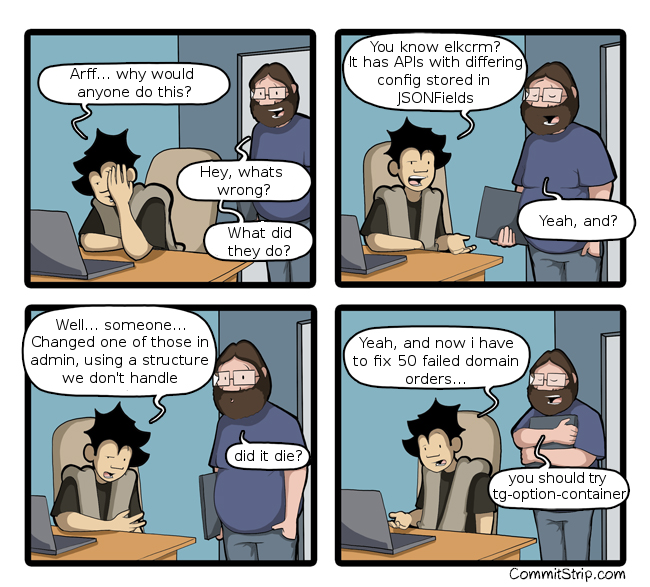

# tg-option-container

Jürno Ader

- Twitter: [@jyrno42](https://twitter.com/jyrno42)
- GitHub: [github.com/jyrno42](https://github.com/jyrno42)
- Project: [thorgate/tg-option-container](https://github.com/thorgate/tg-option-container)
- Slides: [github.com/jyrno42/knowledge_tg_option_container](https://github.com/jyrno42/knowledge_tg_option_container)

Note:

    Hello! This is a quick intro to tg-option-container.

***

## What is tg-option-container?

- Container for dictionary-like validated data structures

Note:

tg-option-container is a container for dictionary-like validated data structures

---

## When would i use it?

---



<small>* original from commitstrip.com</small>

***

## Example: Parsing yaml

---

### The yaml

```yaml
description: >
    Domain names may be formed from the set of alphanumeric
    ASCII characters (a-z, 0-9). In addition the hyphen ("-")
    is permitted if it is not the first or the last character
    of a label.
allow:
    characters:
        - ['a', 'b', 'c', 'd', 'e', 'f', 'g', 'h', 'i', 'j', 'k',
           'l', 'm', 'n', 'o', 'p', 'q', 'r', 's', 't', 'u', 'v',
           'w', 'x', 'y', 'z', '0', '1', '2', '3', '4', '5', '6',
           '7', '8', '9', '-']
deny:
    endswith:
        - "-"
    startswith:
        - "-"
    regex:
        - "^.{2}\\-\\-"
```

---

### The import

```
from tg_option_container import Option, OptionContainer
```

---

### The `Charset`:

```py
class Charset(OptionContainer):
    props = [
        Option.string('description', None),
        Option.nested('allow', CharsetAllow),
        Option.nested('deny', CharsetDeny),
    ]
```

---

### The `CharsetAllow`:

```py
class CharsetAllow(OptionContainer):
    props = [
        Option('characters', default=set(), expected_type=set,
            clean=clean_to_set_str),
        Option.string('endswith', default=''),
        Option.string('startswith', default=''),
    ]
```

---

### The `CharsetDeny`:

```py
class CharsetDeny(OptionContainer):
    props = [
        Option('characters', default=set(), expected_type=set,
            clean=clean_to_set_str),
        Option('endswith', default=set(), expected_type=set,
            clean=clean_to_set_str),
        Option('startswith', default=set(), expected_type=set,
            clean=clean_to_set_str),
        Option('regex', default=set(), expected_type=set,
            clean=clean_to_set_str),
    ]
```

---

### The `is_domain_name_valid` for `Charset`

```py
def is_domain_name_valid(self, value):
    if not value:
        return False

    # Validate allowed characters
    if not all(c in self['allow']['characters'] for c in value):
        return False

    # Validate allowed startswith
    if self['allow']['startswith']:
        if not value.startswith(self['allow']['startswith']):
            return False

    # Validate allowed endswith
    if self['allow']['endswith']:
        if not value.endswith(self['allow']['endswith']):
            return False

    # Validate denied characters
    if self['deny']['characters']:
        if any(c in self['deny']['characters'] for c in value):
            return False

    # Validate denied startswith
    if self['deny']['startswith']:
        d_s = self['deny']['startswith']

        if any(value.startswith(x) for x in d_s):
            return False

    # Validate denied endswith
    if self['deny']['endswith']:
        d_e = self['deny']['endswith']

        if any(value.endswith(x) for x in d_e):
            return False

    if self['deny']['regex']:
        d_r = self['deny']['regex']

        if any(re.match(x, value) for x in d_r):
            return False

    return True
```

---

### Usage

```py
import yaml


# Read file data
with open('charset.yaml') as handle:
    yaml_document = yaml.safe_load(handle)

# Parse the structure
charset = Charset(**yaml_document)

# use it to validate domain names
charset.is_domain_name_valid('example.com')  # True
charset.is_domain_name_valid('ex--ample.com') # False
```

***

## Thank you

- Project: [thorgate/tg-option-container](https://github.com/thorgate/tg-option-container)
- Slides: [github.com/jyrno42/knowledge_tg_option_container](https://github.com/jyrno42/knowledge_tg_option_container)


Note:

Thanks everyone. Please take a look at the project in Github, use it, and let me know what caused you issues
or if you are missing some features.
