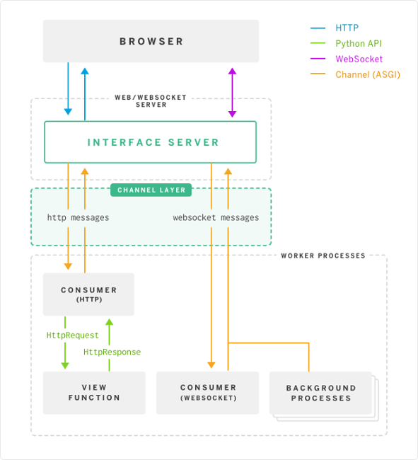

# Django Channels

Jörgen Ader

- Twitter: [@JorgenAder](https://twitter.com/JorgenAder)
- GitHub: [github.com/metsavaht](https://github.com/metsavaht)
- Project: [django/channels](https://github.com/django/channels)
- Example Project: [metsavaht/no-design-slack-clone](https://github.com/metsavaht/no-design-slack-clone)
- Slides: [github.com/metsavaht/knowledge_django_channels](https://github.com/metsavaht/knowledge_django_channels)

Note:

    Hello! This is a small intro to Django channels.

***

#### Standard Django


<small>* original from blog.heroku.com</small>

***

## Channels

- ASGI(Asynchronous Server Gateway Interface)
  - Support multiple common protocol styles
  - Channels and Messages
- Daphne
- Channel layer
- Consumers

Note:

    Django's standard views revolves around requests and responses.
    Channels adds event driven

---

### What does Channels provide?

- Easy HTTP long polling
- Full user session and auth for WebSockets
- Built-in primitives for mass triggering of events
- Optional low-level HTTP control on a per-URL basis
- Extendability to other protocols or event sources

***

#### How?



<small>* original from blog.heroku.com</small>

Note:
    
    It separates Django into two process types:

    - One that handles HTTP and WebSockets
    - One that runs views, websocket handlers and background tasks (consumers)
    
    Communication via ASGI protocol
    
    - Daphne
    - asgiref and different backends
        - memory
        - redis
        - POSIX IPC

***

### Setting up

```
pip install django channels asgi_redi
```

---

#### settings.py

```
CHANNEL_LAYERS = {
   "default": {
       "BACKEND": "asgi_redis.RedisChannelLayer",
       "CONFIG": {
           "hosts": 'redis://localhost:6379',
       },
       "ROUTING": "myapp.routing.channel_routing",
   },
}
```

---

#### routing.py

```
channel_routing = [
   # Wire up websocket channels to our consumers:
   route("websocket.connect", ws_connect, path=r"^/echo/"),
   route("websocket.receive", ws_receive),
   route("websocket.disconnect", ws_disconnect),
]
```

---

#### consumers.py

```
def ws_connect(message):
   message.reply_channel.send({'accept': True})
   Group('friends').add(message.reply_channel)

def ws_disconnect(message):
   Group('friends').discard(message.reply_channel)
   
def ws_receive(message):
    Group('friends').add({'text': message[text]})
```

---

#### Running

```
web: daphne example.asgi:channel_layer
worker: python manage.py runworker
```

***

## Generic consumer & Multiplexing

- Class-based
- Automatic group join/leave
- Single channel for multiple consumer

---

```
class MyConsumer(WebsocketConsumer):
    http_user = True

    def connection_groups(self, **kwargs):
        return ["test"]

    def connect(self, message, **kwargs):
        self.message.reply_channel.send({"accept": True})

    def receive(self, text=None, bytes=None, **kwargs):
        # Simple echo
        self.send(text=text, bytes=bytes)

    def disconnect(self, message, **kwargs):
        pass
```

---

```
class EchoConsumer(websockets.JsonWebsocketConsumer):
    def connect(self, message, multiplexer, **kwargs):
        multiplexer.send({"status": "I just connected!"})

    def disconnect(self, message, multiplexer, **kwargs):
        print("Stream %s is closed" % multiplexer.stream)

    def receive(self, content, multiplexer, **kwargs):
        # Simple echo
        multiplexer.send({"original_message": content})

class Demultiplexer(WebsocketDemultiplexer):
    # Wire your JSON consumers here: {stream_name : consumer}
    consumers = {
        "echo": EchoConsumer,
        "other": AnotherConsumer,
    }
```

***

## Data binding
- Works two way
  - Changes through Django are sent to clients
  - Clients can create/update/delete 
- Limitations
  - Any change outside of Django (or with `QuerySet.update`)
  - Serialization (built-in Django)

---

```
class IntegerValue(models.Model):
    name = models.CharField(max_length=100, unique=True)
    value = models.IntegerField(default=0)

class IntegerValueBinding(WebsocketBinding):
    model = IntegerValue
    stream = "intval"
    fields = ["name", "value"]

    @classmethod
    def group_names(cls, instance):
        return ["intval-updates"]

    def has_permission(self, user, action, pk):
        return True

class Demultiplexer(WebsocketDemultiplexer):
    consumers = {
        "intval": IntegerValueBinding.consumer,
    }
    def connection_groups(self):
        return ["intval-updates"]
```

***

## Thank you

- Testing Project: [metsavaht/no-design-slack-clone](https://github.com/metsavaht/no-design-slack-clone)
- Examples: [andrewgodwin/channels-examples](https://github.com/andrewgodwin/channels-examples)
- Slides: [metsavaht/knowledge_django_channels](https://github.com/metsavaht/knowledge_django_channels)
- [ASGI Spec](http://channels.readthedocs.io/en/latest/asgi.html)
